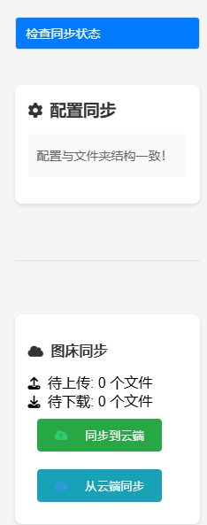

# 🌟 AstrBot 表情包管理器

一个功能强大的 AstrBot 表情包管理插件，支持 🤖 AI 智能发送表情、🌐 WebUI 管理界面、☁️ 云端同步等特性。

## 🚀 功能特点

| 功能                    | 描述                                                             |
| ----------------------- | ---------------------------------------------------------------- |
| 🤖 AI 智能识别          | 自动识别对话场景，发送合适的表情                                 |
| 🖼️ 快速上传和管理表情包 | 通过命令快速上传和管理表情包                                     |
| 🌐 WebUI 管理界面       | 提供便捷的 WebUI 管理界面                                        |
| ☁️ 云端图床同步         | 支持与云端图床同步，方便多设备使用                               |
| 🎯 精确的表情分类系统   | 通过类别管理表情，提升使用体验                                   |
| 🔒 安全的访问控制机制   | 确保管理界面的安全性，防止未授权访问                             |
| 📊 表情发送控制         | 可以控制每次发送的表情数量和频率                                 |
| 🔄 自动维护 Prompt      | 所有 prompt 会根据修改的表情包文件夹目录自动维护，无需手动添加！ |

## 📦 安装方法

1. 确保已安装 AstrBot
2. 将插件复制到 AstrBot 的插件目录（你也可以使用 Astrbot 的插件管理器安装，或下载本项目上传压缩包）
3. 重启 AstrBot 或使用热加载命令

## ⚙️ 配置说明

插件配置项包括：

- `image_host`: 选择图床服务 (目前支持 stardots)
- `image_host_config`: 图床配置信息
- `webui_port`: WebUI 服务端口号
- `max_emotions_per_message`: 每条消息最大表情数量
- `emotions_probability`: 表情触发概率 (0-100)
- `strict_max_emotions_per_message`: 是否严格限制表情数量

## 📝 使用指令

| 指令                        | 描述                    |
| --------------------------- | ----------------------- |
| `/表情管理 查看图库`        | 📚 列出所有可用表情类别 |
| `/表情管理 添加表情 [类别]` | ➕ 添加新表情到指定分类 |
| `/表情管理 开启管理后台`    | 🚀 启动 WebUI 服务      |
| `/表情管理 关闭管理后台`    | 🔒 关闭 WebUI 服务      |
| `/表情管理 同步状态`        | 🔄 检查同步状态         |
| `/表情管理 同步到云端`      | ☁️ 将本地表情同步到云端 |
| `/表情管理 从云端同步`      | ⬇️ 从云端同步表情到本地 |

## 🎉 AI 表情使用

AI 会自动识别对话中的表情标记（格式：⬡ 表情类别 ⬡），并发送对应类别的表情。例如：

- ⬡happy⬡ - 发送开心表情 😊
- ⬡confused⬡ - 发送困惑表情 😕
- ⬡sad⬡ - 发送伤心表情 😢

## 🖥️ WebUI 功能预览

以下是 WebUI 的功能预览：

| 功能             | 预览图示                                                      |
| ---------------- | ------------------------------------------------------------- |
| 登录界面         |                  |
| 表情包管理界面   |  |
| 同步状态检查界面 |    |

## 📜 更新日志

### v3.0

- 🔄 完全重构代码架构
- 🌟 新增 WebUI 管理界面
- ☁️ 添加图床同步功能
- 🤖 优化表情识别算法

### v2.2

- 🎉 增加更多表情包
- 🛠️ 修复 TTS 兼容性问题

### v2.1

- ⚡ 优化消息发送逻辑
- ✉️ 文本和表情分开发送

### v2.0

- 🌐 支持网络图片上传
- 🔧 优化上传流程

### v1.x

- 🚀 初始版本发布
- 📦 基础表情管理功能
- 🖼️ 多图上传支持

## ⚠️ 注意事项

1. WebUI 服务需要管理员权限才能开启
2. 使用云端同步功能前需要正确配置图床信息
3. 请勿将 WebUI 访问密钥分享给未授权用户

## 🛠️ 问题反馈

如果遇到问题或有功能建议，欢迎在 GitHub 提交 Issue。

## 📄 许可证

本项目基于 MIT 许可证开源。
