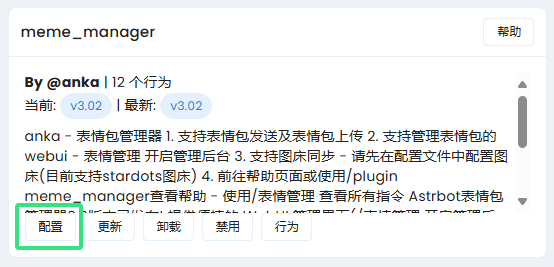
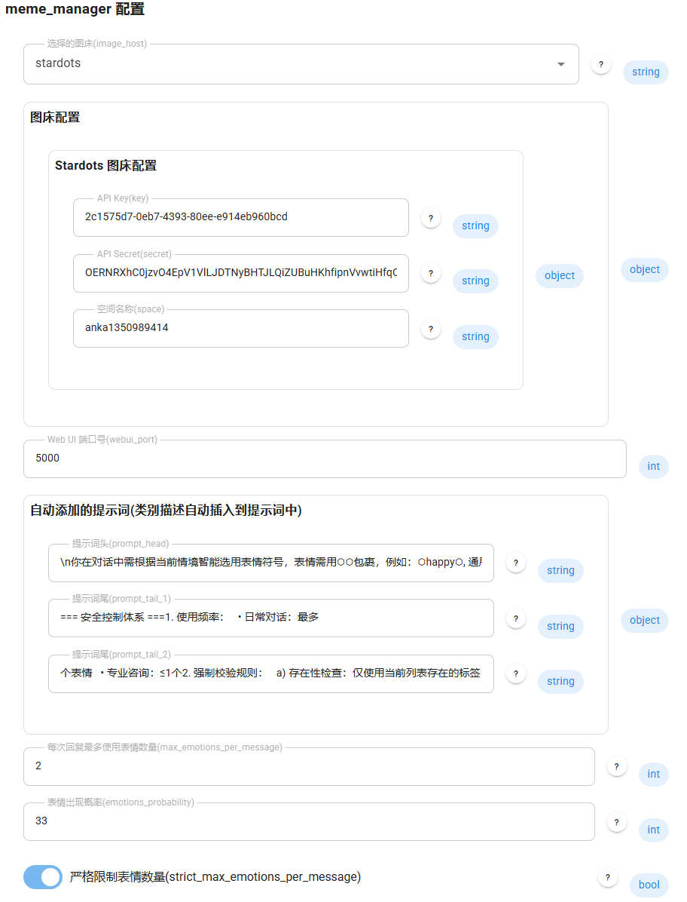
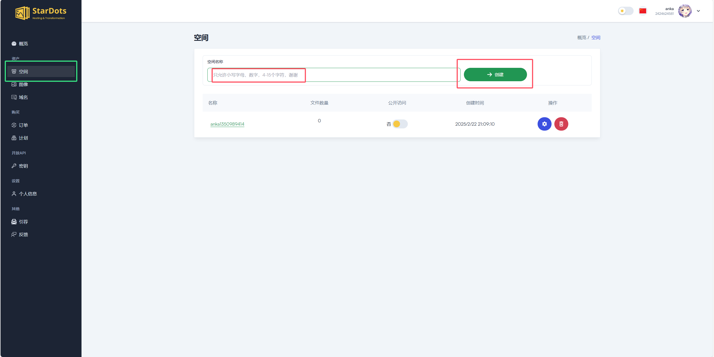
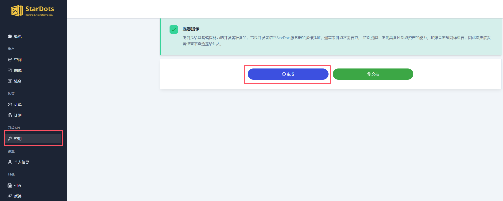
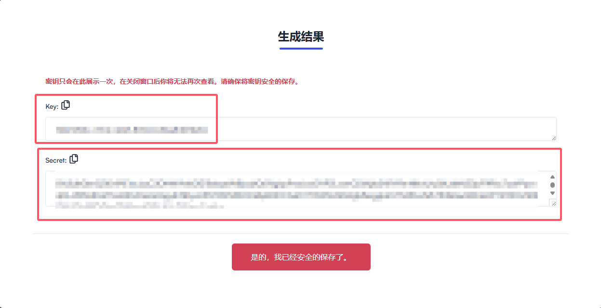
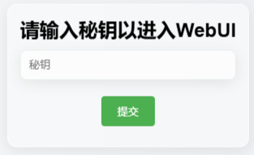
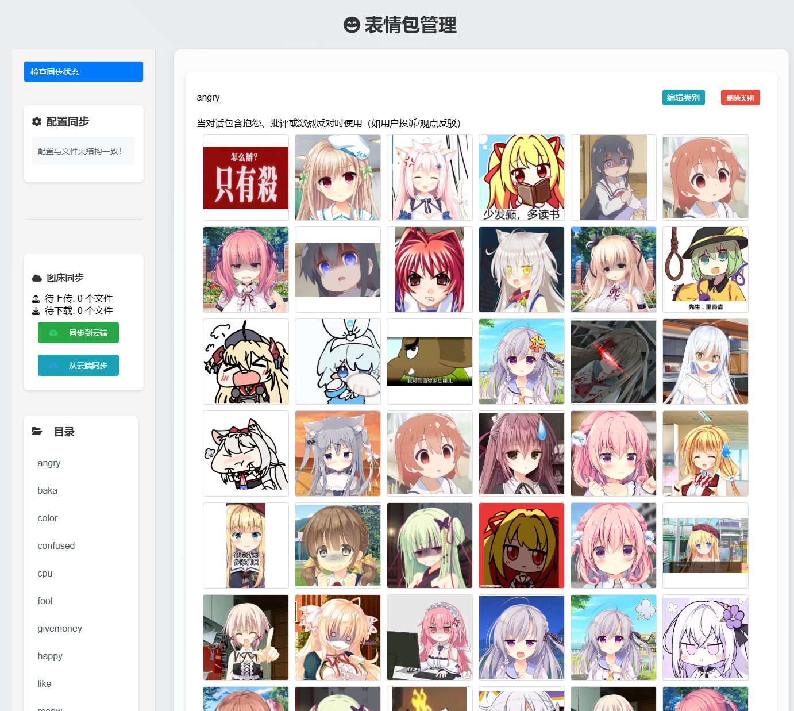

# 🌟 AstrBot 表情包管理器

<div align="center">

[](https://opensource.org/licenses/MIT)


[](CONTRIBUTING.md)
[](https://github.com/anka-afk/astrbot_plugin_meme_manager/graphs/contributors)
[](https://github.com/anka-afk/astrbot_plugin_meme_manager/commits/main)

</div>

<div align="center">

[](https://github.com/anka-afk/astrbot_plugin_meme_manager)

</div>

## 📑 目录

- [🌟 AstrBot 表情包管理器](#-astrbot-表情包管理器)
  - [📑 目录](#-目录)
  - [📢 通知](#-通知)
    - [🎉 现在支持微信了(Gewechat) (2025-02-25)](#-现在支持微信了gewechat-2025-02-25)
    - [⚠️ 重要更新说明 (2025-02-24)](#️-重要更新说明-2025-02-24)
  - [❓ 常见问题](#-常见问题)
  - [🚀 功能特点](#-功能特点)
  - [📦 安装方法](#-安装方法)
  - [🛠️ 第一次使用](#️-第一次使用)
  - [☁️ 图床配置](#️-图床配置)
  - [⚙️ 配置说明](#️-配置说明)
  - [📝 使用指令](#-使用指令)
  - [🖥️ WebUI 功能预览](#️-webui-功能预览)
  - [📜 更新日志](#-更新日志)
    - [v3.0x](#v30x)
    - [v3.0](#v30)
    - [v2.2](#v22)
    - [v2.1](#v21)
    - [v2.0](#v20)
    - [v1.x](#v1x)
  - [⚠️ 注意事项](#️-注意事项)
  - [🛠️ 问题反馈](#️-问题反馈)
  - [📄 许可证](#-许可证)

一个功能强大的 AstrBot 表情包管理插件，支持 🤖 AI 智能发送表情、🌐 WebUI 管理界面、☁️ 云端同步等特性。

## 📢 通知

### 🎉 更新宽松匹配等模式, 极大减少 llm 胡乱输出如:`angryangryangry`, `[happy]`等情况

### 🎉 现在支持微信了(Gewechat) (2025-02-25)

### ⚠️ 重要更新说明 (2025-02-24)

**问题修复**：修复了由罕见 Unicode 字符导致的提示词混淆问题。此问题会导致 bot 发送错误的表情标记，例如：`⬧work⬧`。

**必要操作**：由于 Astrbot 不会自动更新配置，请选择以下任一方式进行更新：

1. **方式一**：删除配置文件并重启

   - 删除文件：`Astrbot/data/config/astrbot_plugin_meme_manager_config.json`
   - 重启 Astrbot

2. **方式二**：手动修改配置
   - 打开 Astrbot 管理界面
   - 进入 meme_manager 配置
   - 找到`自动添加的提示词->提示词头`
   - 将原有的提示词头替换为以下新格式：

```
\n你在对话中需根据当前情境智能选用表情符号，表情需用&&包裹，例如：&&happy&&, 通用格式:&&标签&&。选择逻辑遵循以下动态规则：[智能触发机制]1. 关键词匹配：当对话内容包含以下类型词汇时激活表情使用   - 核心情绪词（开心/生气/惊讶等）→ 直接匹配对应标签   - 场景特征词（早安/报酬/思考等）→ 关联场景标签   - 语气调节词（请/建议/但是等）→ 触发软化型表情2. 动态优先级：   a) 精确匹配现有标签 > 同义词扩展 > 放弃使用   b) 高频使用标签优先于低频标签[表情标签库]（当前可用）格式：标签 - 使用场景描述当前可用：
```

> 💡 提示：复制上方代码块中的内容即可。

**注意**：此次更新涉及核心配置变更，必须完成上述任一操作才能正常使用。

## ❓ 常见问题

1. **Q: 如何快速开始使用这个插件？**

   - A: 只需安装插件并重启 AstrBot 即可，无需修改任何人格设置。插件会自动配置所需的提示词和初始表情包。(⚠️ 重要：请勿在人格设置中添加任何表情相关提示词)

2. **Q: WebUI 无法访问怎么解决？**

   - A: 请按以下步骤排查：
     1. Docker 部署用户请先确保已映射端口，详见：[ISSUE#1](https://github.com/anka-afk/astrbot_plugin_meme_manager/issues/1)
     2. 使用内网穿透的用户需配置 NAT 转发，将内网 5000 端口映射到外网
     3. 云服务器用户请检查安全组是否已放行 5000 端口的入站规则

3. **Q: 是否必须配置图床才能使用？**

   - A: 不需要。除了云端同步功能外，其他所有功能（包括表情管理后台）都可以正常使用。图床配置是可选的。

4. **Q: 如何管理表情包？**

   - A: 使用命令 `/表情管理 开启管理后台` 启动 WebUI，在管理界面中您可以：
     - 添加/删除表情包
     - 创建/修改表情分类
     - 编辑表情描述（用于指导 bot 使用场景）
       所有修改都会实时生效，无需重启或额外配置。

5. **Q: 插件是否包含预设表情包？**

   - A: 是的。首次启动时，插件会自动检测并安装一套精心挑选的初始表情包，让您可以立即开始使用。

6. **Q: 最佳实践是什么？**

   - A: 推荐以下使用流程：
     1. 安装插件后直接使用 `/reset` 重置当前对话
     2. 无需修改任何人格设置或添加额外提示词
     3. 需要更多自定义设置时，请参考[🛠️ 第一次使用](#️-第一次使用)章节

## 🚀 功能特点

| 功能                    | 描述                                                             |
| ----------------------- | ---------------------------------------------------------------- |
| 🤖 AI 智能识别          | 自动识别对话场景，发送合适的表情                                 |
| 🖼️ 快速上传和管理表情包 | 通过命令快速上传和管理表情包                                     |
| 🌐 WebUI 管理界面       | 提供便捷的 WebUI 管理界面                                        |
| ☁️ 云端图床同步         | 支持与云端图床同步，方便多设备使用                               |
| 🎯 精确的表情分类系统   | 通过类别管理表情，提升使用体验                                   |
| 🔒 安全的访问控制机制   | 确保管理界面的安全性，防止未授权访问                             |
| 📊 表情发送控制         | 可以控制每次发送的表情数量和频率                                 |
| 🔄 自动维护 Prompt      | 所有 prompt 会根据修改的表情包文件夹目录自动维护，无需手动添加！ |

## 📦 安装方法

1. 确保已安装 AstrBot
2. 将插件复制到 AstrBot 的插件目录（你也可以使用 Astrbot 的插件管理器安装，或下载本项目上传压缩包）
3. 重启 AstrBot 或使用热加载命令

## 🛠️ 第一次使用

注意：第一次使用请先进行配置，配置步骤如下：

1. **打开设置**：进入设置界面，如图所示：
   

2. **进行设置**：根据以下说明进行配置，你也可以点击问号了解配置说明：
   

   > **注意**：你需要设置好图床的 API Key、API Secret 和空间名称，才能正常使用图床同步等功能。如果不设置图床信息，默认无法使用图床功能，其他功能如 WebUI 可以正常使用。

## ☁️ 图床配置

本插件目前支持 **stardots** 图床。

1. **注册账号**：如果没有账号，你需要先注册一个 stardots 账号，或直接使用其他方式登录。

   > Stardots 图床免费账户支持 1 个空间，2024 张图像（对于表情包来说是足够的），每月 10GB 流量传输。免费账户对于我们同步存储表情包的需求来看是足够的。

2. **建立空间**：注册账号后，你需要先建立一个空间，操作如图所示：
   

   > 记住你建立的空间的名字，将其填入插件设置中的图床配置信息的空间名称中。

3. **获取 API Key 和 API Secret**：在同样的界面，点击左侧的"开放 API" -> "密钥"，点击生成密钥：
   

   你会看到如下画面：
   

   将其中的 API Key 和 API Secret 填入插件设置中的图床配置信息中，点击保存配置，AstrBot 将会重启。

   > 打开 WebUI 获取同步信息或发送 `/表情管理 同步状态` 享受图床同步功能！

## ⚙️ 配置说明

插件配置项包括：

- `image_host`: 选择图床服务 (目前支持 stardots)
- `image_host_config`: 图床配置信息
- `webui_port`: WebUI 服务端口号
- `max_emotions_per_message`: 每条消息最大表情数量
- `emotions_probability`: 表情触发概率 (0-100)
- `strict_max_emotions_per_message`: 是否严格限制表情数量
- `enable_loose_emotion_matching`: 是否启用宽松的表情匹配
- `enable_alternative_markup`: 是否启用备用标记
- `enable_repeated_emotion_detection`: 是否启用重复表情检测
- `high_confidence_emotions`: 高置信度表情列表

## 📝 使用指令

| 指令                        | 描述                    |
| --------------------------- | ----------------------- |
| `/表情管理 查看图库`        | 📚 列出所有可用表情类别 |
| `/表情管理 添加表情 [类别]` | ➕ 添加新表情到指定分类 |
| `/表情管理 开启管理后台`    | 🚀 启动 WebUI 服务      |
| `/表情管理 关闭管理后台`    | 🔒 关闭 WebUI 服务      |
| `/表情管理 同步状态`        | 🔄 检查同步状态         |
| `/表情管理 同步到云端`      | ☁️ 将本地表情同步到云端 |
| `/表情管理 从云端同步`      | ⬇️ 从云端同步表情到本地 |

## 🖥️ WebUI 功能预览

以下是 WebUI 的功能预览：

| 功能           | 预览图示                                                      |
| -------------- | ------------------------------------------------------------- |
| 登录界面       |                  |
| 表情包管理界面 |  |

## 📜 更新日志

### v3.1x

- 💡 新增宽松匹配模式, 备用标记匹配, 重复表情检测, 高置信度表情设置
- 🛠️ 修复 webui 中的上传, 我是猪鼻
- 🛠️ 提供 webp 格式支持

### v3.0x

- 🛠️ 修复消息类型不支持查看问题
- 🎉 移除了 imghdr 依赖, 现在兼容更高版本 python

### v3.0

- 🔄 完全重构代码架构
- 🌟 新增 WebUI 管理界面
- ☁️ 添加图床同步功能
- 🤖 优化表情识别算法

### v2.2

- 🎉 增加更多表情包
- 🛠️ 修复 TTS 兼容性问题

### v2.1

- ⚡ 优化消息发送逻辑
- ✉️ 文本和表情分开发送

### v2.0

- 🌐 支持网络图片上传
- 🔧 优化上传流程

### v1.x

- 🚀 初始版本发布
- 📦 基础表情管理功能
- 🖼️ 多图上传支持

## ⚠️ 注意事项

1. WebUI 服务需要管理员权限才能开启
2. 使用云端同步功能前需要正确配置图床信息
3. 请勿将 WebUI 访问密钥分享给未授权用户

## 🛠️ 问题反馈

如果遇到问题或有功能建议，欢迎在 GitHub 提交 Issue。

## 📄 许可证

本项目基于 MIT 许可证开源。
